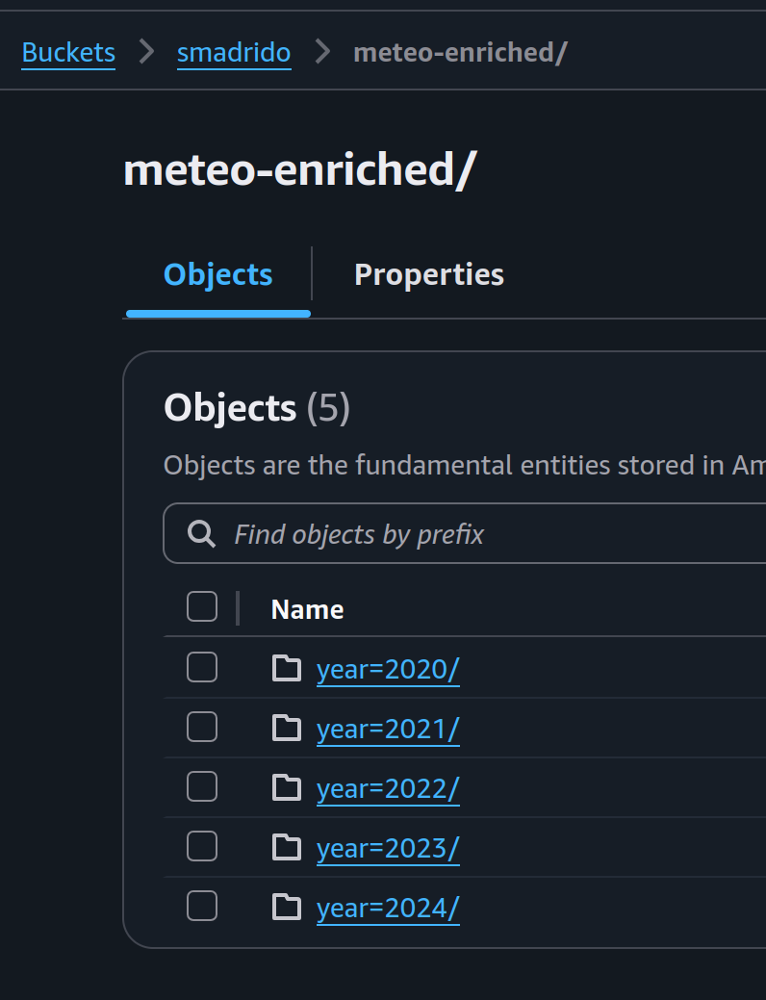

Para poder hacer la ingestas de datos desde el API de Open-Meteo creamos un script que basado en las coordenadas de las estaciones (latitud, longitud), pide ciertos datos de los que carece el Dataset del gobierno y que nos permiten responder mas preguntas de negocio, ademas el script utilizado para hacer esto es [ingest_openmeteo](./ingest_openmeteo.py). Este script fue ejecutado desde una EC2 donde tuvimos algo de problemas con la RAM de las instancias pero de igual forma logramos subir los datos a **s3://smadrido/meteo-enriched/** 

	

Ademas se almacenan de una vez con una particion de Hive que es un mecanismo para almacenar mas eficiente.