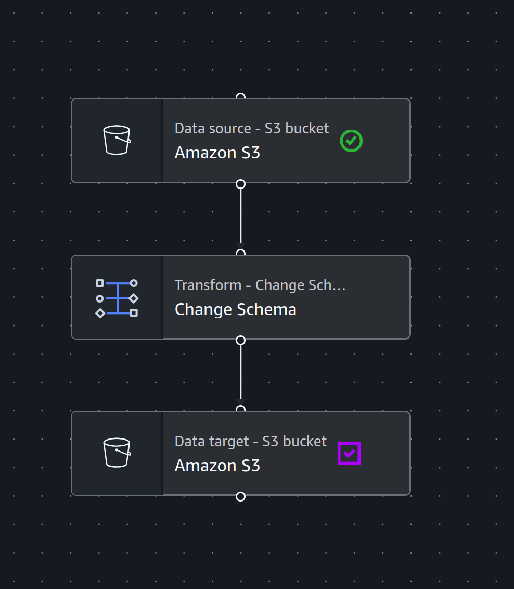
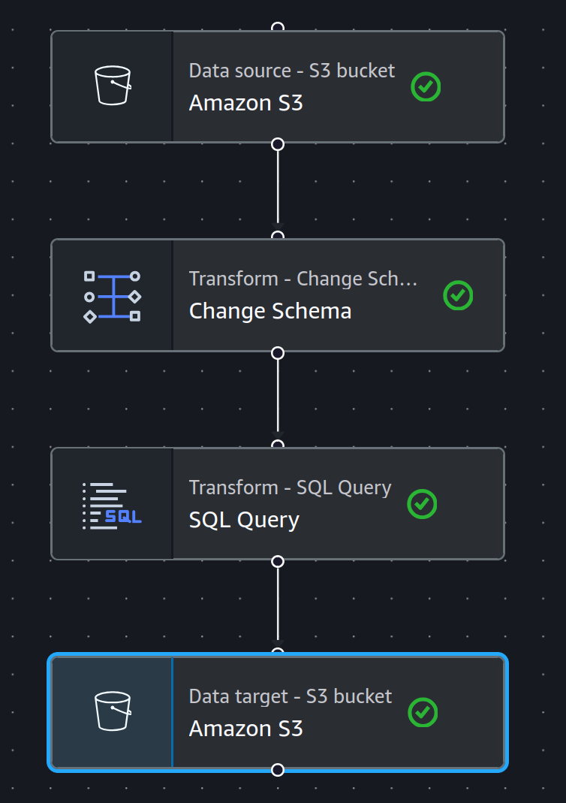

El data set esta en formato ```.csv``` y aunque en la documentacion oficial las columnas tienen diferentes tipos de datos, en el data set todo esta siendo tratado como texto, para solucionar esto y optimizar el almacenamiento como AWS nos indica, vamos a pasarle los datos a un Job de AWS Glue para que corriga tipos y cambie el formato a ```.parquet```, este es el pipeline de AWS Glue



Ahora con esto ya tenemos los valores de tipo **Double** y **Int** pdriamos empezar a modelar la informacion en HIVE pero, todavia falta las fechas. Para esto lo mas sencillo seria usar PySpark pero como este herada las propiedades de la tabla creada con HIVE, para seguir un pipeline organizado, agregamos una transformacion al ETl donde cambiamos el formato a las fechas usando SQLQuery Transform con la siguiente consulta [Date-format-correction.sql](./dateFormatCorrection.sql)



