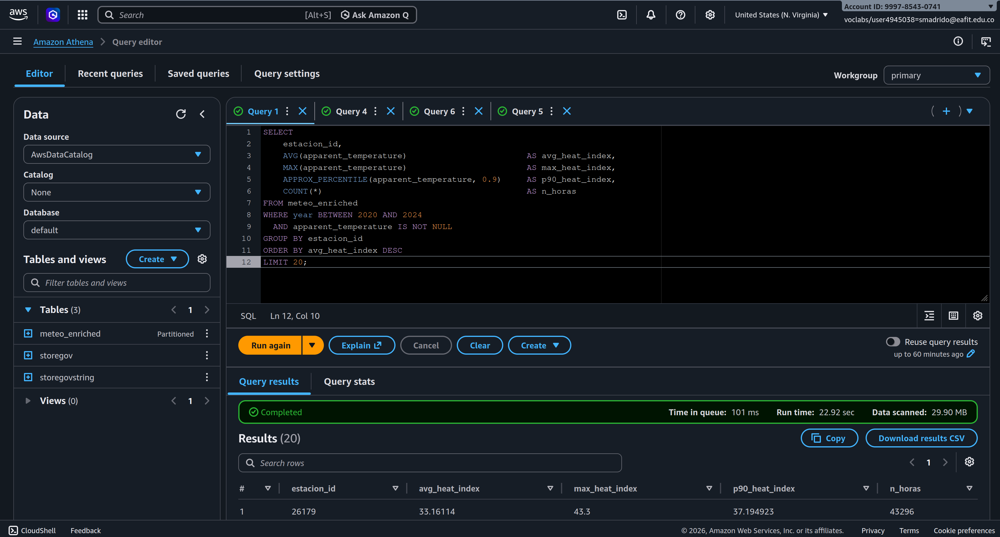
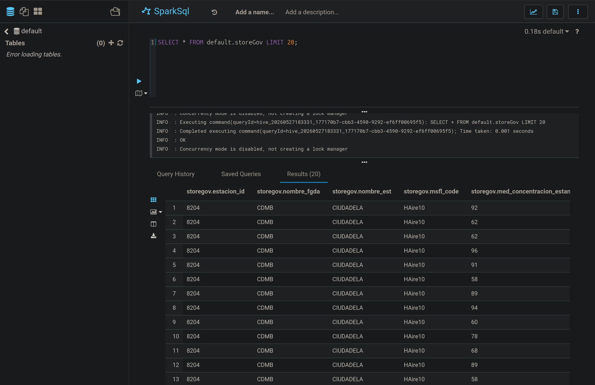
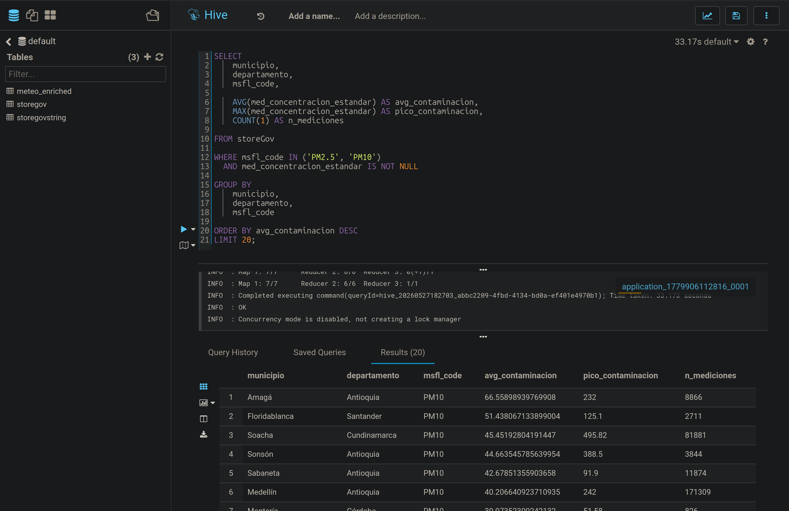
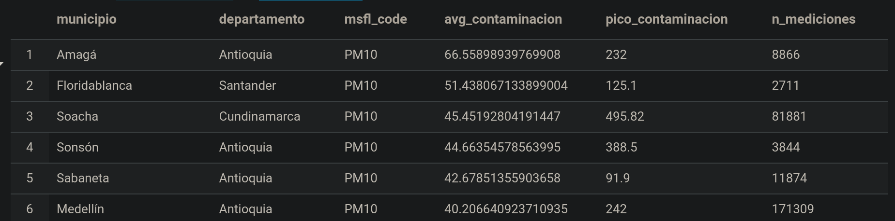

# Data Analysis: Weather Dataset

For the data analysis, we utilized **Hive**, **Athena**, and **SparkSQL** to extract insights from the enriched meteorological dataset. Below, we present evidence of tool usage, results, and interpretations for each analytical question.

---

## Athena Usage Evidence

Athena automatically loads Hive partitions from the `meteo_enriched` dataset, making queries more efficient. See the evidence below:

  

All SQL queries used to answer the questions are available in [SQLAnalysis.sql](./SQLAnalysis.sql).

---

## 1. Which station has the highest average heat index (apparent temperature)?

<strong>View Results Table</strong>

| #  | Station ID | Avg Heat Index | Max Heat Index | 90th Percentile | Hours   |
|----|------------|----------------|----------------|-----------------|---------|
| 1  | 26179      | 33.16          | 43.3           | 37.19           | 43,296  |
| 2  | 31879      | 32.84          | 46.4           | 38.67           | 43,296  |
| 3  | 9051       | 32.84          | 46.4           | 38.69           | 43,296  |
| 4  | 9053       | 32.79          | 46.9           | 38.67           | 43,296  |
| 5  | 32009      | 32.77          | 45.7           | 38.09           | 43,296  |
| ...| ...        | ...            | ...            | ...             | ...     |

> **Insight:**
>
> The station with ID **26179** (AEROPUERTO, Magdalena, Santa Marta) records the highest average heat index, indicating the greatest perceived temperature.

---

## 2. Is it hotter during the first or second half of the month?

<strong>View Results Table</strong>

| #  | Station ID | Half of Month | Avg Apparent Temp | Avg Real Temp | Std Apparent Temp | Hours   |
|----|------------|---------------|-------------------|---------------|-------------------|---------|
| 1  | 8204       | First Half    | 24.47             | 21.75         | 3.11              | 21,240  |
| 2  | 8204       | Second Half   | 24.44             | 21.70         | 3.06              | 22,056  |
| 3  | 8205       | First Half    | 25.58             | 22.51         | 3.00              | 21,240  |
| 4  | 8205       | Second Half   | 25.57             | 22.46         | 2.95              | 22,056  |
| ...| ...        | ...           | ...               | ...           | ...               | ...     |

> **Interpretation:**
>
> The answer depends on the location. For example, at station **8208** (LAS FERIAS, Bogotá, D.C.), the second half of the month is slightly warmer. However, the difference is minimal, reflecting Colombia's lack of pronounced seasons and relatively stable temperatures year-round.

---

## SparkSQL Usage Evidence

We used SparkSQL in HUE to answer the next question. See the evidence below:

  

---

## 3. Which stations record the highest annual accumulated precipitation, and how does it vary across years?

<strong>View Results Table</strong>

| # | Station ID | Year | Total Precip. (mm) | Avg Precip./Hour | Hours  |
|---|------------|------|--------------------|------------------|--------|
| 1 | 31983      | 2021 | 11,758.4           | 1.34             | 8,760  |
| 2 | 31983      | 2020 | 11,302.8           | 1.29             | 8,784  |
| 3 | 31983      | 2022 | 10,114.0           | 1.15             | 8,760  |
| 4 | 31948      | 2022 | 9,462.8            | 1.08             | 8,760  |
| 5 | 31948      | 2023 | 9,189.3            | 1.05             | 8,760  |

> **Insight:**
>
> The stations with the highest accumulated precipitation are **Belalcázar, Caldas** and **Villamaría, Caldas**. There is noticeable variation in annual totals across years.

---

## 4. How does average relative humidity vary throughout the year, and what is its relationship with apparent temperature?

<strong>View Results Table</strong>

| Year | Month | Avg Heat Index | Avg Humidity | Avg Real Temp | Hours   |
|------|-------|----------------|--------------|---------------|---------|
| 2020 | 01    | 23.89          | 73.96        | 22.18         | 291,648 |
| 2020 | 02    | 24.68          | 70.56        | 23.07         | 272,832 |
| 2020 | 03    | 24.65          | 72.01        | 22.98         | 291,648 |
| 2020 | 04    | 25.22          | 78.67        | 22.66         | 282,240 |
| 2020 | 05    | 25.52          | 81.35        | 22.61         | 291,648 |
| 2020 | 06    | 24.51          | 81.81        | 21.87         | 282,240 |
| 2020 | 07    | 24.22          | 81.84        | 21.63         | 291,648 |
| 2020 | 08    | 24.53          | 81.64        | 21.82         | 291,648 |
| 2020 | 09    | 24.29          | 82.71        | 21.50         | 282,240 |
| 2020 | 10    | 24.16          | 83.14        | 21.42         | 291,648 |
| 2020 | 11    | 23.83          | 86.06        | 21.00         | 282,240 |
| 2020 | 12    | 23.59          | 80.45        | 21.35         | 291,648 |

> **Interpretation:**
>
> As humidity increases, the heat index also rises, indicating a positive correlation. The heat index tends to be lower at the beginning and end of the year.

---

## Hive Usage Evidence

For the final question, we used Hive. See the evidence below:

  

### Result Example

  

---

## 5. Which departments have the most stations with high temperature records?

> **Observation:**
>
> Several occurrences are found in the department of **Antioquia**, including Medellín. However, the capital does not always appear, possibly due to a lack of stations in the city or the strategic placement of existing ones in surrounding areas.
